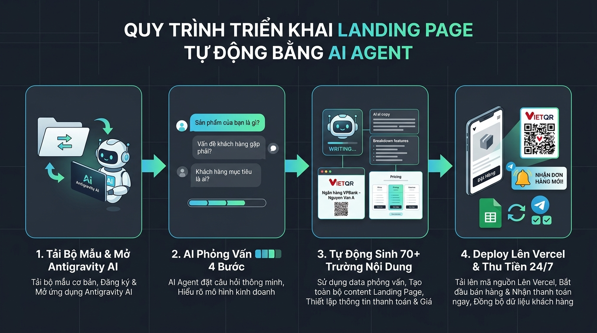

# 📋 HƯỚNG DẪN TRIỂN KHAI CHI TIẾT (CẦM TAY CHỈ VIỆC)

Tài liệu này dành cho người mới bắt đầu muốn đưa trang web bán hàng tự động lên mạng trong vòng **5 phút**.

---

## 3 BƯỚC THỰC HIỆN TỰ ĐỘNG BẰNG ANTIGRAVITY AI

### 🔹 Bước 1: Mở dự án trong Antigravity
1. Tải về file mã nguồn và giải nén.
2. Mở thư mục này bằng **Google Antigravity**.

---

### 🔹 Bước 2: Ra lệnh cho AI tạo nội dung
Nhập vào khung chat câu lệnh theo cấu trúc:
> *"Tạo giúp mình landing page bán [Tên sản phẩm của bạn] với giá [Số tiền] VNĐ"*

**Ví dụ:**
- *"Tạo giúp mình landing page bán Khóa Học Dựng Phim CapCut Thực Chiến giá 399.000 VNĐ"*
- *"Tạo landing page bán Bộ Tài Nguyên Preset Lightroom giá 199.000 VNĐ"*
- *"Tạo landing page bán Dịch vụ Coaching Tư Vấn Tài Chính 1-1 giá 1.500.000 VNĐ"*

AI sẽ tự động hỏi bạn 4 câu hỏi ngắn để hiểu rõ khách hàng và nỗi đau của họ, sau đó tự động:
- Viết mới toàn bộ ~70 trường nội dung marketing bán hàng.
- Thiết lập thông tin ngân hàng và mã QR chuyển khoản.
- Tự động kiểm tra lỗi (build).

---

### 🔹 Bước 3: Đưa web lên mạng (Deploy Vercel)
Sau khi AI viết xong, bạn bảo AI:
> *"Deploy web này lên Vercel giúp mình"*

AI sẽ tự động đẩy trang web lên và trả về cho bạn đường link trực tiếp (ví dụ: `https://ten-du-an-cua-ban.vercel.app`).

---

## 🛠️ CẤU HÌNH CÁC TÀI KHOẢN TỰ ĐỘNG HÓA

Để hệ thống tự động nhận tiền và báo đơn 24/7, bạn cần chuẩn bị 3 thông tin sau:

### 1. Tài khoản SePay (Tự động nhận diện tiền về)
- **Đăng ký miễn phí tại**: [my.sepay.vn](https://my.sepay.vn)
- **Liên kết ngân hàng**: Vào mục *Ngân hàng* $\rightarrow$ Thêm tài khoản ngân hàng của bạn (TPBank, MB Bank, Techcombank, VPBank, Vietcombank...).
- **Lấy API Key**: Vào *Cài đặt* $\rightarrow$ *API Keys* $\rightarrow$ Tạo và sao chép mã Key để điền vào `SEPAY_API_KEY`.
- **Cài đặt Webhook**: Sau khi web lên Vercel, vào *Cài đặt* $\rightarrow$ *Webhook* $\rightarrow$ Thêm webhook: `https://[link-web-cua-ban]/api/payment/webhook`.

### 2. Bot Telegram (Nhận thông báo đơn hàng vào điện thoại)
- Mở Telegram, tìm bot `@BotFather` $\rightarrow$ Gõ `/newbot` $\rightarrow$ Đặt tên bot $\rightarrow$ Nhận mã `TELEGRAM_BOT_TOKEN`.
- Tìm bot `@userinfobot` $\rightarrow$ Bấm Start để lấy `Id` của bạn $\rightarrow$ Điền vào `TELEGRAM_CHAT_ID`.

### 3. Google Sheets (Lưu danh sách khách hàng tự động)
- Tạo một bảng Google Sheet mới.
- Vào *Tiện ích mở rộng* $\rightarrow$ *Apps Script* $\rightarrow$ Dán mã script lưu lead $\rightarrow$ Triển khai dưới dạng Web App $\rightarrow$ Lấy URL điền vào `GOOGLE_SCRIPT_URL`.

---

## 💡 CÂU HỎI THƯỜNG GẶP (FAQ)

**Q: Tôi không biết code thì có dùng được không?**  
A: Hoàn toàn được. AI Agent sẽ làm thay 100% công việc sửa code, viết nội dung và tải lên hosting. Bạn chỉ cần trả lời các câu hỏi về sản phẩm của mình.

**Q: Tôi có phải trả phí duy trì hàng tháng không?**  
A: Không. Web chạy trên Vercel miễn phí, SePay có gói miễn phí, Google Sheets và Telegram hoàn toàn miễn phí.

**Q: Khi đổi sản phẩm khác thì làm thế nào?**  
A: Bạn chỉ cần mở Antigravity lên và gõ lệnh đổi sản phẩm mới, AI sẽ tự động cập nhật toàn bộ trang trong 2 phút.
