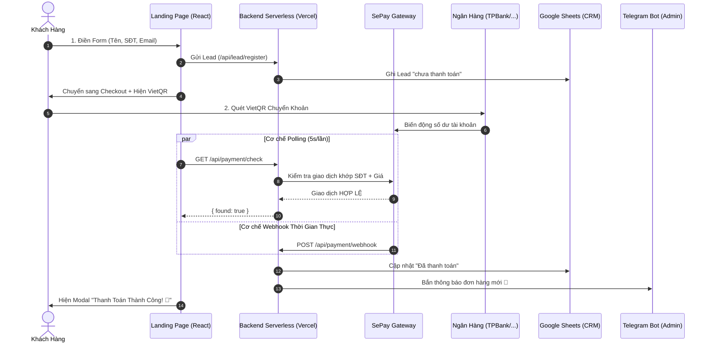

# 🚀 Bộ Mẫu Landing Page Bán Hàng Tự Động (VietQR + SePay + Antigravity AI Agent)

> **Giải pháp đóng gói "Ăn Ngay"**: Biến bất kỳ ý tưởng sản phẩm / dịch vụ / khóa học nào thành một trang bán hàng chuyển đổi cao có hệ thống thanh toán tự động 24/7, đồng bộ Google Sheet và báo đơn qua Telegram chỉ trong **2–3 phút** bằng AI Agent.

---

## 🖼️ Sơ Đồ Quy Trình Triển Khai


---

## ⚡ Các Tính Năng Đột Phá

| Tính năng | Mô tả chi tiết |
|---|---|
| 🤖 **AI Copywriting 70+ Trường** | Tích hợp **Mega Prompt Miss Bán Hàng 4 bước**, tự động đào sâu nỗi đau, lợi ích, câu chuyện, lộ trình, bonus và value stack theo từng ngành hàng cụ thể. |
| 💳 **Thanh Toán VietQR Động** | Tự động sinh mã VietQR theo từng đơn hàng với số tiền và cú pháp chuyển khoản riêng biệt (chống nhầm lẫn). |
| 🔍 **Tự Động Bắt Giao Dịch (SePay)** | Khách chuyển khoản $\rightarrow$ SePay API tự động nhận diện $\rightarrow$ Màn hình nhảy popup *"Thanh toán thành công"* ngay lập tức. |
| 🔔 **Báo Đơn Tức Thì Qua Telegram** | Bắn thông báo về Telegram bot cá nhân ngay khi có khách đăng ký lead hoặc thanh toán thành công. |
| 📊 **Lưu Lead & Đơn Vào Google Sheets** | Tự động ghi nhận thông tin khách hàng, số điện thoại, email và trạng thái đơn hàng vào bảng tính Google Sheets. |
| 🚀 **Deploy 1-Click Lên Vercel** | Sẵn sàng production với chi phí hosting 0đ trên nền tảng Vercel Serverless Functions. |

---

## 🔄 Kiến Trúc Vận Hành Hệ Thống



---

## 🛠️ Hướng Dẫn Triển Khai Nhanh

### 🅰️ Cách 1: Tự Động 100% Bằng Antigravity AI (Khuyến Nghị)

Nếu bạn sử dụng **Google Antigravity**:
1. Tải và mở thư mục mã nguồn này trong Antigravity.
2. Gõ lệnh yêu cầu bất kỳ vào khung chat:
   > *"Tạo cho tôi landing page bán [Tên sản phẩm/dịch vụ] giá [Giá bán]"*
3. **AI sẽ tự động thực hiện 6 bước**:
   - Phỏng vấn 4 câu hỏi định vị kinh doanh (Miss Bán Hàng).
   - Hỏi thông tin tài khoản ngân hàng & API Keys của bạn.
   - Tự động viết mới toàn bộ ~70 trường nội dung marketing trong `src/content.ts`.
   - Cập nhật cấu hình thanh toán trong `src/site.config.ts`.
   - Build và kiểm tra lỗi biên dịch tự động.
   - Deploy trực tiếp lên tài khoản Vercel của bạn và trả link web live!

---

### 🅱️ Cách 2: Cấu Hình Thủ Công

#### 1. Cài đặt dependencies:
```bash
npm install
```

#### 2. Cấu hình thông tin người bán & ngân hàng:
Mở file `src/site.config.ts` và chỉnh sửa:
```typescript
export const siteConfig = {
  product: {
    name: "Tên Sản Phẩm Của Bạn",
    price: "499.000",
    originalPrice: "2.990.000",
    category: "ngành hàng",
    transferPrefix: "ORDER", // Tiền tố nội dung CK
  },
  seller: {
    name: "Tên Của Bạn",
    phone: "0934688632",
    email: "email@domain.com",
    zalo: "0934688632",
  },
  payment: {
    bankCode: "TPB",           // Mã ngân hàng (TPB, MB, VCB, TCB,...)
    bankName: "TPBank",
    accountNumber: "88804101986", // Số tài khoản ngân hàng của bạn
    accountName: "NGUYEN DUC VIET", // Tên chủ tài khoản IN HOA KHÔNG DẤU
  },
  branding: {
    siteName: "TÊN THƯƠNG HIỆU",
    footerBrand: "BRAND NAME",
    domain: "yourdomain.com",
    copyright: "COPYRIGHT 2026",
  },
};
```

#### 3. Thiết lập biến môi trường (.env):
Sao chép `.env.example` thành `.env`:
```bash
cp .env.example .env
```
Điền các giá trị:
```bash
COURSE_AMOUNT=499000
SEPAY_API_KEY=your_sepay_api_key
GOOGLE_SCRIPT_URL=https://script.google.com/macros/s/.../exec
TELEGRAM_BOT_TOKEN=your_bot_token
TELEGRAM_CHAT_ID=your_chat_id
```

#### 4. Chạy thử nghiệm cục bộ:
```bash
npm run dev
```

#### 5. Build và Deploy lên Vercel:
```bash
npm run build
npx vercel --prod
```

---

## ⚙️ Cấu Hình SePay Webhook (Sau Khi Deploy)

1. Đăng nhập vào [my.sepay.vn](https://my.sepay.vn).
2. Vào **Cài đặt** $\rightarrow$ **Webhook** $\rightarrow$ **Thêm Webhook**.
3. Điền thông tin:
   - **URL Webhook**: `https://[ten-mien-cua-ban].vercel.app/api/payment/webhook`
   - **Phương thức**: `POST`
   - **Sự kiện**: Tất cả biến động số dư tiền vào.
4. Bấm **Lưu** để kích hoạt webhook thời gian thực.

---

## 📂 Cấu Trúc Thư Mục Dự Án

```text
├── .agents/
│   └── skills/
│       └── nhan-ban-landing-v2/     # Antigravity Skill tự động hóa nhân bản
│           ├── SKILL.md
│           └── references/
│               ├── content-schema.md
│               └── mega-prompt-banhang.md
├── api/
│   ├── lead/
│   │   └── register.ts              # API tiếp nhận lead & ghi Google Sheet
│   └── payment/
│       ├── check.ts                 # API Polling kiểm tra GD SePay
│       ├── confirm.ts               # API xác nhận đơn & bắn Telegram
│       └── webhook.ts               # API nhận Webhook trực tiếp từ SePay
├── public/
│   ├── fonts/                       # Phông chữ Việt hóa cao cấp
│   ├── gifs/                        # Ảnh động minh họa
│   └── so-do-trien-khai.jpg         # Sơ đồ quy trình trực quan
├── src/
│   ├── components/                  # ParticleCanvas, StudioBackground, UI
│   ├── sections/                    # 15 Sections giao diện chuyển đổi cao
│   ├── App.tsx                      # Component chính của Landing Page
│   ├── Checkout.tsx                 # Trang thanh toán VietQR thông minh
│   ├── LiveSocialProof.tsx          # Popup thông báo mua hàng thời gian thực
│   ├── content.ts                   # Dữ liệu nội dung marketing (~70+ trường)
│   └── site.config.ts               # Cấu hình trung tâm (Giá, Bank, Brand)
├── .env.example                     # Mẫu biến môi trường
├── package.json
├── vercel.json                      # Cấu hình định tuyến Vercel Serverless
└── vite.config.ts
```

---

## 📄 Bản Quyền & Phát Triển

Phát triển bởi **Nguyễn Đức Việt** (@vietndj) — Tối ưu hóa cho hệ sinh thái **Google Antigravity AI Agent**.
Mọi thắc mắc và hỗ trợ xin liên hệ qua kênh Telegram hoặc Zalo.
